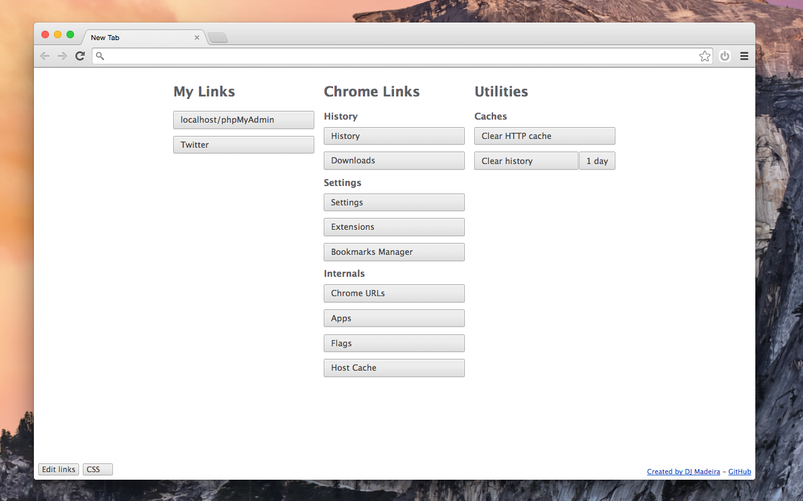

# Lightweight New Tab Page

I don't like the default new tab, and I haven't found a different one that added any more value for me than the default. So I made a ridiculously simple page of my own. 

# Installation

Install from the [chrome web store](https://chrome.google.com/webstore/detail/lightweight-new-tab-page/cahfgmimpeeiibiicmeengglhpnhbkki), or you can [build it from source](https://developer.chrome.com/extensions/packaging).

# Planned features

I always plan to keep this simple & fast, so I won't add a ton of features. I'm open to good ideas, but ultimately this is for me. That said, this is licensed under WTFPL; if you want to change it, be my guest!

* Keyboard shortcut reminders
* Recently closed tabs
* Reorder custom links

# Changelog

## 1.2.3
* Fixed a bug where custom links didn't work if you didn't already have the localStorage records set

## 1.2
* Improved accessiblity
* Packaged for web store
* Created an icon

## 1.1
* Added customizable links
* Added custom CSS

## 1.0
* Initial release